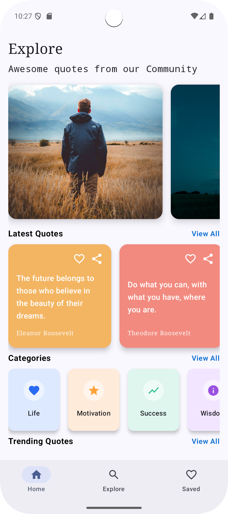
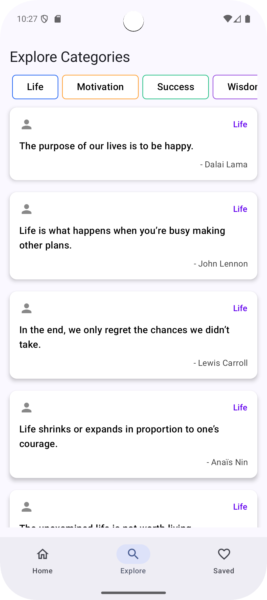

# Simple Quotes Application


# 📜 Simple Quotes App

A simple Android application that displays inspirational quotes using **Jetpack Compose**.  
The app is built with **Kotlin**, follows modern Android development practices, and uses **StateFlow** for state management and **Jetpack Navigation** for screen navigation.

---

<br/>
<p align="center">
  
  
  
</p>
<br/>


---
## 🛠️ Built With

- **Kotlin**
- **Jetpack Compose** – Modern UI toolkit
- **StateFlow** – Reactive state management
- **Jetpack Navigation (Compose)** – Screen navigation
- **MVVM Architecture**

---

## ✨ Features

- Display a list of quotes
- View quote details
- Clean and modern UI with Jetpack Compose
- State handling using StateFlow
- Navigation between screens

---

## 📐 Architecture

The app follows **MVVM (Model–View–ViewModel)** architecture:

- **Model** – Holds quote data
- **ViewModel** – Manages UI state using `StateFlow`
- **UI (Compose)** – Observes state and renders UI
- **Navigation** – Handles screen transitions

---

## 🔄 State Management

State is managed using **StateFlow**:
- ViewModel exposes UI state
- Compose UI collects state using `collectAsState()`
- Ensures lifecycle-aware updates

---

## 🧭 Navigation

Jetpack Navigation Compose is used to:
- Navigate between Quote List and Quote Detail screens
- Maintain clean and structured navigation logic

---


## 🚀 Getting Started

### Prerequisites
- Android Studio (latest version recommended)
- Android SDK


### Run the App
1. Clone the repository
   ```bash
   https://github.com/chandra1234456/Quotes-App.git